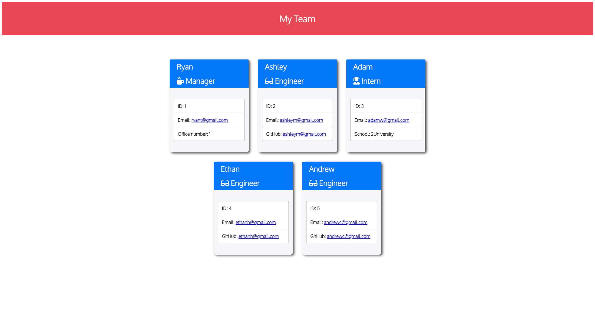

# team-profiler

## Description

A command line tool that uses Node an Inquirer to generate an html page containing a team profile. A series of questions is asked about members of your team and corresponding profile cards are created using Employee objects to respresent the info of each employee.

## Tools Used
- Node.js
- Inquirer.js
- Jest
- Node Package Manager
- HTML
- CSS
- Oject Oriented Programming

https://user-images.githubusercontent.com/97649021/170786665-22297d63-26d6-4627-b974-19adaf734262.mp4

